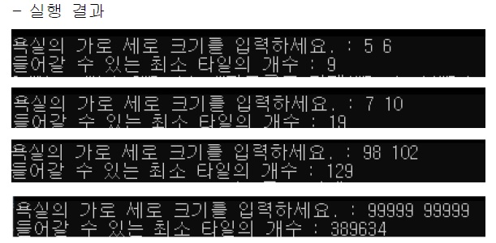
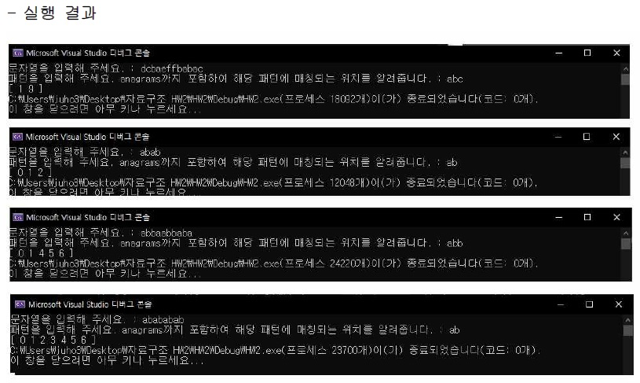
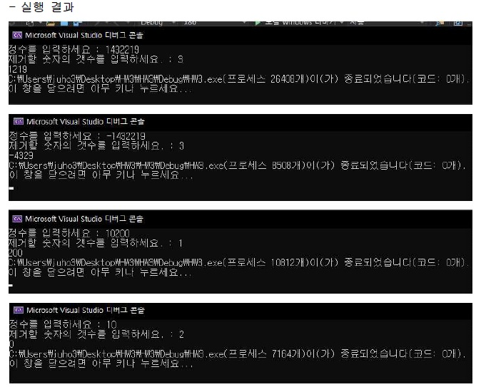
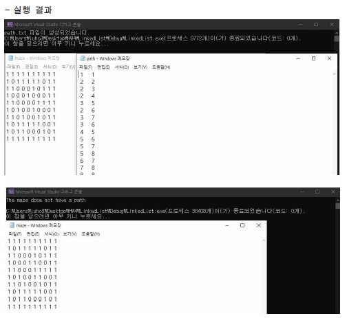
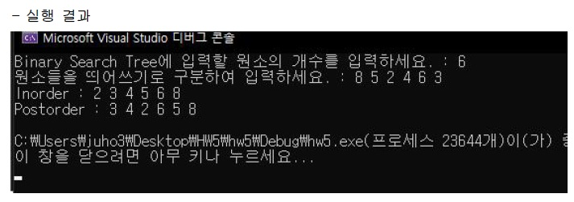
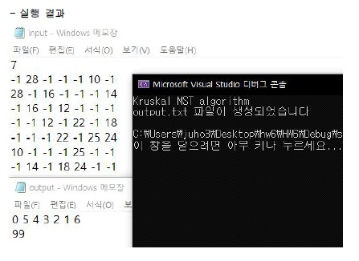

# Data Structure lecture in 2020-2 semester

- Learning a Data Structure in C language in 2020-2 semester
- Write serveral algorithm codes associated with serveral data structures
- Reference - [*Horowitz*]Fundamentals of *Data Structures in C*

- In each folder, there are other problems and `Documents` related to them.

## HW1 - Recursive function

## HW2 - KMP algorithm

## HW3 - Stack and Queue

## HW4 - Linked List

## HW5 - Tree

## HW6 - Graph

